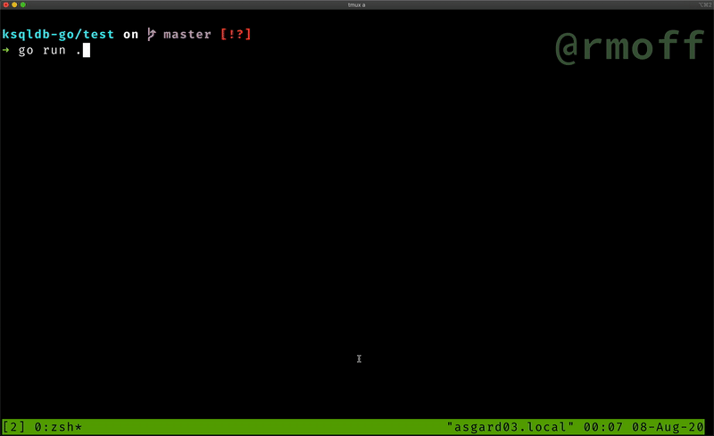

= ksqlDB Go library
Robin Moffatt <robin@moffatt.me>
v0.01, 29 July 2020

:toc:

This is a Go client for https://ksqldb.io/[ksqlDB]. It supports both pull and push queries. 

⚠️ Disclaimer #1: https://rmoff.net/2020/06/25/learning-golang-some-rough-notes-s01e00/[I am brand new to Go!] Tips (or PRs) to improve the code very welcome :)

⚠️ Disclaimer #2: This is a personal project and not supported or endorsed by Confluent.

== Installation

Module install:

This client is a Go module, therefore you can have it simply by adding the following import to your code:

[source,golang]
----
import "github.com/rmoff/ksqldb-go"
----

Then run a build to have this client automatically added to your go.mod file as a dependency.

Manual install:

[source,bash]
----
go get -u github.com/rmoff/ksqldb-go
----

== Examples

See the link:test/environment.adoc[test environment here], and link:test/main.go[this sample code] which you can run with

[source,bash]
----
go run ./test/
----

=== Pull query

[source,go]
----
k := "SELECT TIMESTAMPTOSTRING(WINDOWSTART,'yyyy-MM-dd HH:mm:ss','Europe/London') AS WINDOW_START, TIMESTAMPTOSTRING(WINDOWEND,'HH:mm:ss','Europe/London') AS WINDOW_END, DOG_SIZE, DOGS_CT FROM DOGS_BY_SIZE WHERE DOG_SIZE='" + s + "';"
m, e := ksqldb.Pull(ksqlDBServer, k)

if e != nil {
    return fmt.Errorf("Error running Pull request against ksqlDB:\n%v", e)
}

var WINDOW_START string
var WINDOW_END string
var DOG_SIZE string
var DOGS_CT float64
for _, msg := range m {
    if r := msg.Row.Columns; r != nil {

        WINDOW_START = r[0].(string)
        WINDOW_END = r[1].(string)
        DOG_SIZE = r[2].(string)
        DOGS_CT = r[3].(float64)
        fmt.Printf("🐶 There are %v dogs size %v between %v and %v\n", DOGS_CT, DOG_SIZE, WINDOW_START, WINDOW_END)
    }
}
----

=== Push query

[source,go]
----
rc := make(chan ksqldb.KsqlDBMessageRow)
k := "SELECT ROWTIME, ID, NAME, DOGSIZE, AGE FROM DOGS EMIT CHANGES;"
var DATA_TS float64
var ID string
var NAME string
var DOG_SIZE string
var AGE string

go func() {
    for row := range rc {
        if r := row.Row.Columns; r != nil {

            DATA_TS = r[0].(float64)
            ID = r[1].(string)
            NAME = r[2].(string)
            DOG_SIZE = r[3].(string)
            AGE = r[4].(string)

            // Handle the timestamp
            t := int64(DATA_TS)
            ts := time.Unix(t/1000, 0).Format(time.RFC822)

            log.Printf("🐾New dog logged at %v: %v is %v and %v (id %v)", ts, NAME, DOG_SIZE, AGE, ID)
        }
    }

}()
e := ksqldb.Push(ksqlDBServer, k, rc)

if e != nil {
    return fmt.Errorf("Error running Push request against ksqlDB:\n%v", e)
}
----

== TODO

🔲 Add support for the newer https://docs.ksqldb.io/en/latest/developer-guide/ksqldb-rest-api/streaming-endpoint/[`query-stream`] endpoint (N.B. HTTP2 only)

🔲 Add support for https://docs.ksqldb.io/en/latest/developer-guide/ksqldb-rest-api/ksql-endpoint/[`ksql`] endpoint so that applications can create their own materialised views etc natively

🔲 Check error handling is sufficient

🔲 Add custom error types for different conditions (e.g. `no rows returned`)

🔲 Add support for passing parameters in queries
